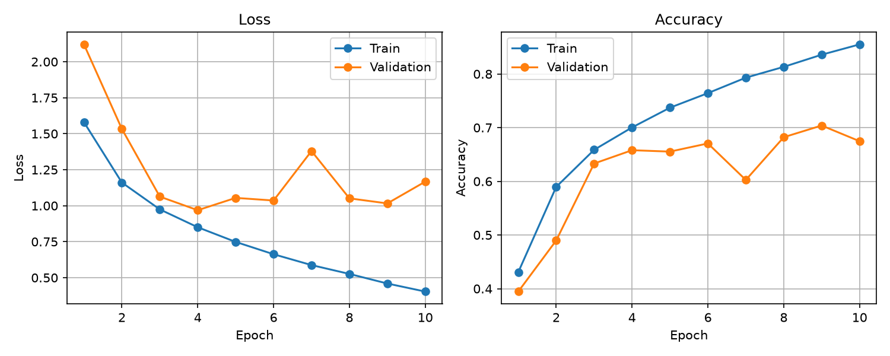
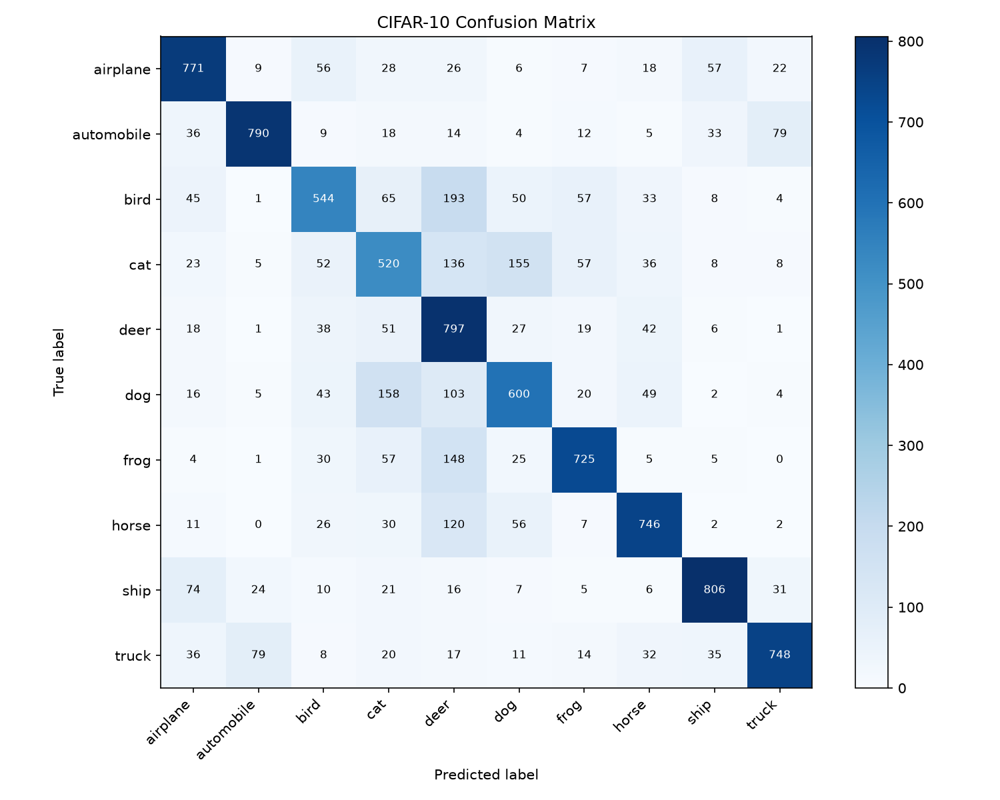

# CIFAR-10 Controlled Experiments

基于 PyTorch 的 CIFAR-10 图像分类实验项目，重点不在追求复杂模型或最高准确率，而在建立一套可复现的训练、验证、测试和误差分析流程。

项目使用独立验证集选择候选配置，最终测试集仅用于一次性评估；围绕训练数据规模、数据增强、Dropout 和 Weight Decay 进行了受控实验，并对最终 Dropout 配置完成三个随机种子的配对复验。

## 实验结论

在 25% 训练池上使用验证集筛选后，选定 `augmentation=none`、`Dropout=0.3`、`weight_decay=0`。将该配置扩展到 100% 训练池，并使用种子 42、123、999 与无 Dropout 基线进行配对比较：

| 配置 | 测试准确率（均值 ± 样本标准差） |
| --- | ---: |
| 无 Dropout | 68.77% ± 1.92% |
| Dropout=0.3 | **71.84% ± 1.22%** |
| 配对提升 | **+3.07 ± 0.74 个百分点** |

三个种子下 Dropout 均带来正向提升。该结论只适用于当前 SimpleCNN、优化器、学习率和训练轮数，不代表对其他模型或训练设置仍然成立。





完整实验设计、逐种子结果和局限性见 [实验报告](docs/experiment_report.md) 与 [正式实验总结](results/formal_validation/README.md)。

## 功能

- CIFAR-10 / FashionMNIST 数据加载与分层训练—验证划分
- SimpleCNN 训练、验证集选模与 checkpoint 保存
- 独立测试集评估和混淆矩阵生成
- 单张图片预测及 Softmax 置信度输出
- 数据增强、Dropout、Weight Decay 和训练数据比例配置
- CSV 实验记录、多随机种子统计和典型错分分析

## 项目结构

```text
cv-summer-2026/
├── configs/                    # 实验变量与对照设置说明
├── data/                       # 数据集与 DataLoader
├── docs/                       # 正式实验报告
├── models/                     # MLP 与 SimpleCNN
├── results/                    # 正式指标、曲线、混淆矩阵和错误样本
├── utils/                      # 训练、评估、绘图和日志工具
├── train.py                    # 训练与验证入口
├── evaluate.py                 # 最终测试入口
├── predict.py                  # 单图预测入口
├── analyze_errors.py           # 典型错分分析
├── analyze_formal_multiseed.py # 三随机种子统计汇总
└── requirements.txt
```

## 环境配置

项目在 Python 3.12、PyTorch 2.12.1 和 torchvision 0.27.1 下完成验证。训练脚本会自动选择 CUDA 或 CPU。

```powershell
python -m venv .venv
.\.venv\Scripts\Activate.ps1
python -m pip install --upgrade pip
```

根据设备安装 PyTorch（二选一）：

```powershell
# CPU
python -m pip install torch==2.12.1 torchvision==0.27.1 --index-url https://download.pytorch.org/whl/cpu

# NVIDIA GPU / CUDA 12.6
python -m pip install torch==2.12.1 torchvision==0.27.1 --index-url https://download.pytorch.org/whl/cu126
```

安装其余依赖：

```powershell
python -m pip install -r requirements.txt --index-url https://pypi.org/simple
python -m pip check
```

## 训练、评估与预测

运行默认正式配置：

```powershell
python train.py
```

显式指定配置：

```powershell
python train.py --dataset cifar10 --epochs 10 --batch-size 64 --learning-rate 0.1 --train-fraction 1.0 --validation-fraction 0.1 --augmentation none --dropout 0.3 --weight-decay 0 --seed 123
```

训练完成后，使用相同配置加载最佳 checkpoint 并执行最终测试：

```powershell
python evaluate.py --train-fraction 1.0 --validation-fraction 0.1 --augmentation none --dropout 0.3 --weight-decay 0 --seed 123
```

预测单张图片：

```powershell
python predict.py "results\prediction_samples\test_0.png"
```

模型权重 `*.pt` / `*.pth` 不提交到仓库。新环境需要先运行训练命令生成对应 checkpoint，再执行评估或预测。

## 复现实验统计

```powershell
python analyze_formal_multiseed.py
python analyze_errors.py
```

正式候选实验记录保存在 `results/formal_validation_experiments.csv`，锁定配置后的最终测试结果保存在 `results/formal_test_results.csv`。

## 快速检查

```powershell
python -m compileall train.py evaluate.py predict.py analyze_errors.py analyze_formal_multiseed.py data models utils
git diff --check
```

## 项目边界

本项目是面向实验方法与工程复现的学习型项目，不以刷新 CIFAR-10 最优结果为目标。当前结果主要证明了在固定 SimpleCNN 与训练设置下，规范验证流程和多随机种子复验能够比单次实验提供更可靠的结论。
