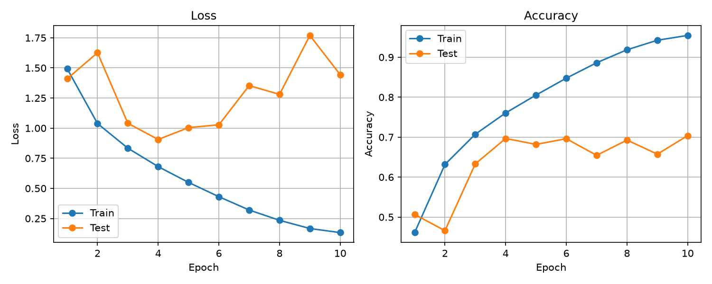
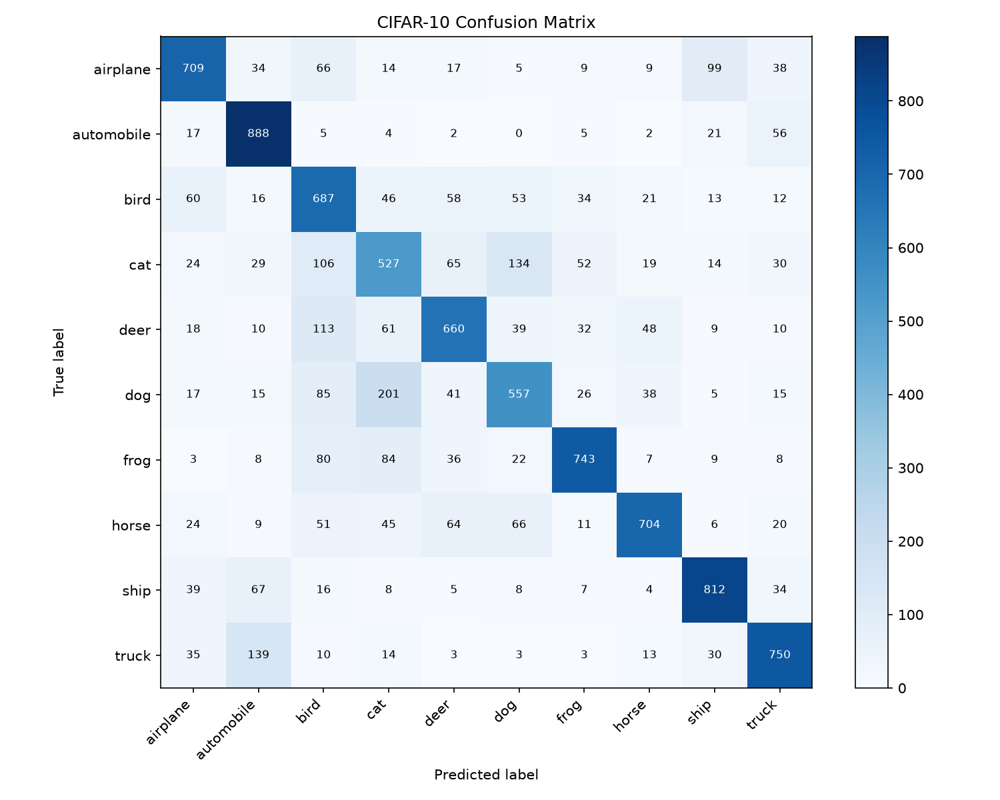

# CV Summer 2026

## 项目简介

本项目是一个基于 PyTorch 的可复现计算机视觉实验项目。项目将先通过 FashionMNIST 跑通完整训练流程，再以 CIFAR-10 图像分类为核心，完成基线模型与正则化方法的对照实验。

## 项目目标

- 建立规范的训练、验证和推理流程
- 搭建 CIFAR-10 CNN 基线模型
- 比较数据增强、Dropout 和 L2 权重衰减
- 使用独立验证集选择模型轮次与实验配置
- 保存训练曲线、混淆矩阵和实验配置
- 形成可复现的代码仓库与实验报告

## 当前进展

- 已使用 FashionMNIST 跑通完整训练、评估、最佳模型保存和结果绘制流程
- 已完成 CIFAR-10 数据管道和 SimpleCNN 基线模型
- 已实现训练指标统计、最佳模型保存和 CSV 实验记录
- 已完成独立评估，并生成训练曲线和混淆矩阵
- 已完成 10%、25%、50% 和 100% 有限训练数据实验
- 已完成三档数据增强对照及两个随机种子的关键配置复验
- 已修正测试集参与选模的问题，并完成 25% 数据四组正式验证实验
- 已由验证集选出 `Dropout=0.3`，并在 100% 训练池上取得 70.47% 的最终测试准确率
- 已完成混淆矩阵、典型错分样本和类别混淆分析
- 已形成完整的 CIFAR-10 受控实验报告
- 已补充命令行参数、依赖文件和单图预测入口

## 项目结构

```text
cv-summer-2026/
├── configs/                 # 受控实验配置与说明
├── data/                    # CIFAR-10/FashionMNIST 数据与 DataLoader
├── models/                  # MLP 和 SimpleCNN 模型
├── notes/                   # 学习记录与实验报告
├── results/                 # 指标、曲线、混淆矩阵和错误样本
├── utils/                   # 训练、评估和实验日志工具
├── train.py                 # 训练与验证入口
├── evaluate.py              # 最终测试与混淆矩阵入口
├── predict.py               # 单张图片预测入口
├── requirements.txt         # Python 第三方依赖
└── README.md                # 项目说明
```

## 运行环境

本项目当前验证环境如下：

- Python 3.12.4
- PyTorch 2.12.1（开发环境使用 CUDA 12.6，干净复现已验证 CPU 版）
- torchvision 0.27.1
- NumPy 2.5.1
- Matplotlib 3.11.0
- Windows PowerShell

训练脚本会自动检测 CUDA。存在可用 NVIDIA GPU 时使用 GPU，否则回退到 CPU；使用 CPU 不影响代码正确性，但训练耗时会更长。

## 环境配置

在项目根目录打开 PowerShell，创建并激活虚拟环境：

```powershell
python -m venv .venv
.\.venv\Scripts\Activate.ps1
```

升级 `pip`：

```powershell
python -m pip install --upgrade pip
```

根据运行设备，从 PyTorch 官方仓库安装 CPU 或 CUDA 12.6 版本（二选一）：

```powershell
# CPU 复现环境
python -m pip install torch==2.12.1 torchvision==0.27.1 --index-url https://download.pytorch.org/whl/cpu

# NVIDIA GPU 开发环境
python -m pip install torch==2.12.1 torchvision==0.27.1 --index-url https://download.pytorch.org/whl/cu126
```

再从官方 PyPI 安装 `requirements.txt` 中的其余依赖：

```powershell
python -m pip install -r requirements.txt --index-url https://pypi.org/simple
```

若全局 `pip` 配置使用第三方镜像，镜像可能没有同步当前锁定版本并报出 `No matching distribution found`；上面的 `--index-url` 会仅对当前命令切换到官方源。CPU 环境同样可以运行项目，但训练耗时会更长。

检查 PyTorch 是否安装成功以及 CUDA 是否可用：

```powershell
python -c "import torch; print(torch.__version__); print(torch.cuda.is_available())"
python -m pip check
```

## 运行项目

首次运行时执行训练脚本。CIFAR-10 不存在时会自动下载。训练期间每轮使用验证集评估，结束后保存验证准确率最高的模型和训练曲线，并把候选实验追加到验证实验 CSV：

```powershell
python train.py
```

不提供参数时使用当前正式实验的默认配置。也可以通过命令行显式指定实验参数：

```powershell
python train.py --dataset cifar10 --epochs 10 --batch-size 64 --learning-rate 0.1 --train-fraction 1.0 --validation-fraction 0.1 --augmentation none --dropout 0.3 --weight-decay 0 --seed 123
```

`--train-fraction` 只接受 `0.1`、`0.25`、`0.5` 和 `1.0`，分别对应 10%、25%、50% 和 100% 训练池；这些固定比例用于保证受控实验之间可以直接比较。

查看全部训练参数：

```powershell
python train.py --help
```

所有候选配置比较完成后，先按验证准确率锁定唯一配置，再单独加载其最佳模型进行一次最终测试并生成混淆矩阵：

```powershell
python evaluate.py
```

评估参数必须与待加载 checkpoint 的训练配置一致。例如：

```powershell
python evaluate.py --train-fraction 1.0 --validation-fraction 0.1 --augmentation none --dropout 0.3 --weight-decay 0 --seed 123
```

查看全部评估参数：

```powershell
python evaluate.py --help
```

模型权重 `*.pth` 属于本地产物，不会提交到 Git。因此，新环境必须先运行 `train.py` 生成对应候选配置的 checkpoint，才能运行 `evaluate.py`。

## 单图预测

`predict.py` 会把输入图片调整为 `32×32` RGB 图片，执行与测试集一致的标准化，然后加载训练完成的 SimpleCNN checkpoint 进行预测。

使用默认正式模型预测：

```powershell
python predict.py "图片完整路径"
```

例如：

```powershell
python predict.py "results\prediction_samples\test_0.png"
```

也可以显式指定 checkpoint：

```powershell
python predict.py "图片完整路径" --checkpoint "模型完整路径" --dropout 0.3
```

查看全部预测参数：

```powershell
python predict.py --help
```

模型会输出计算设备、输入 Tensor 形状、预测类别和 Softmax 置信度。置信度是模型分配给预测类别的概率，不代表预测一定正确。

主要输出位置：

- `results/formal_validation/`：按数据比例和配置保存的正式曲线与本地 checkpoint
- `results/formal_validation_experiments.csv`：只包含训练与验证指标的候选实验记录
- `results/formal_validation/README.md`：正式流程、25% 选模与 100% 对照总结
- `results/formal_test_results.csv`：配置锁定后的最终测试记录
- `results/baseline/`：提交到仓库的基线训练曲线和混淆矩阵
- `results/sample_fraction/`：有限训练数据实验曲线与汇总图
- `results/augmentation/`：数据增强实验曲线与汇总图
- `notes/report_draft.md`：CIFAR-10 受控实验完整报告

修改代码后可先执行快速语法检查：

```powershell
python -m compileall train.py evaluate.py predict.py data models utils
```

## 25% 数据正式实验结果

固定 `seed=123`、10 个 epoch、SGD 和学习率 0.1，在 25% 训练池上由验证集选出 `augmentation=none`、`Dropout=0.3`、`weight_decay=0`。将该配置扩展至 100% 训练池后，最终测试准确率为 70.47%；同规模无 Dropout 基线为 66.73%。完整方法与对照见 [正式实验总结](results/formal_validation/README.md)。

## 早期探索性 CIFAR-10 基线

以下结果来自引入独立验证集之前的探索性流程，仅作为历史学习记录，不用于正式配置选择：

| 配置项 | 数值 |
| --- | --- |
| 训练轮数 | 10 |
| Batch size | 64 |
| 优化器 | SGD |
| 学习率 | 0.1 |
| 最佳轮次 | 10 |
| 测试损失 | 1.4433 |
| 测试准确率 | 70.37% |

### 训练曲线



### 混淆矩阵


