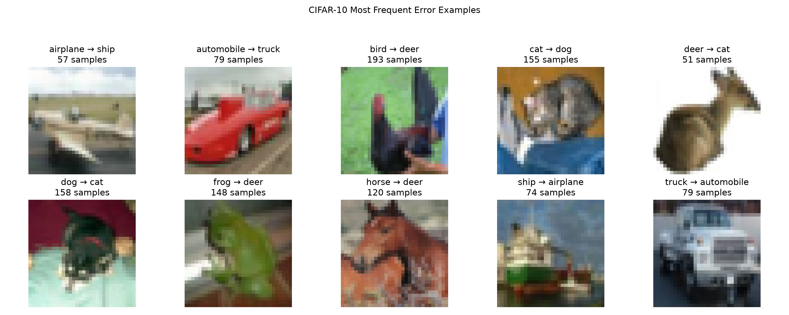

# CIFAR-10 图像分类受控实验报告

## 摘要

本文在 CIFAR-10 十分类任务上，使用 PyTorch 搭建两层卷积的 SimpleCNN，研究训练数据量、数据增强、Dropout 与 Weight Decay 对分类性能的影响，并修正了早期直接用测试集选择模型的流程。正式实验以随机种子 123 将官方训练集分层划分为 45,000 张训练图片与 5,000 张验证图片，由验证集选择训练轮次与候选配置，测试集仅用于最终评估。结果显示，`Dropout=0.3` 在 11,250 张训练图片上取得 61.66% 验证准确率；扩展到全部 45,000 张后验证准确率 70.40%、测试准确率 70.47%，较无 Dropout 基线提高 3.74 个百分点。错误分析表明，主要困难集中在细粒度动物类别与外观相近的交通工具。受限于单一随机种子、固定训练轮数及历史测试集使用，本文结果定位为方法修正后的复验证据，而非普遍最优结论。

## 1. 实验问题

本项目使用 PyTorch 搭建 SimpleCNN，完成 CIFAR-10 十分类任务。实验主要研究以下问题：

1. 训练数据量变化如何影响模型的分类性能。
2. 数据增强、Dropout 和 Weight Decay 在当前模型与训练预算下有什么影响。
3. 在规范划分训练集、验证集和测试集后，有限数据上选出的配置能否迁移到完整训练池。

早期实验曾在每轮训练后直接使用测试集评估并选择最佳模型，因此只能视为探索性实验。后续正式实验重新划分验证集，由验证集选择训练轮次和候选配置，测试集仅用于最终评估。

## 2. 数据集与数据划分

CIFAR-10 包含 50,000 张官方训练图片和 10,000 张官方测试图片，共 10 个类别，每张图片形状为 `3×32×32`。

正式实验使用随机种子 123，对官方训练集按类别进行分层划分：

- 每个类别取 500 张，共 5,000 张作为验证集。
- 剩余 45,000 张组成训练候选池。
- `train_fraction=0.25` 时，从训练候选池中分层抽取 11,250 张。
- `train_fraction=1.0` 时，使用全部 45,000 张训练图片。
- 官方测试集始终保留完整的 10,000 张图片。

训练集可以根据实验配置应用随机数据增强；验证集和测试集仅执行 `ToTensor` 与标准化，不使用随机裁剪、翻转或颜色变换。标准化参数为：

- Mean：`(0.4914, 0.4822, 0.4465)`
- Std：`(0.2470, 0.2435, 0.2616)`

## 3. 模型结构

模型采用两层卷积的 SimpleCNN：

1. `Conv2d(3, 32, kernel_size=3, padding=1)`
2. `ReLU`
3. `MaxPool2d(2)`
4. `Conv2d(32, 64, kernel_size=3, padding=1)`
5. `ReLU`
6. `MaxPool2d(2)`
7. 将 `64×8×8` 特征展平为 4096 维
8. `Linear(4096, 128)`
9. `ReLU`
10. 可配置的 `Dropout`
11. `Linear(128, 10)`

模型最终为每张图片输出 10 个 logits，分别对应 CIFAR-10 的十个类别。

## 4. 训练设置与评价协议

统一训练设置如下：

- Epoch：10
- Batch size：64
- 损失函数：CrossEntropyLoss
- 优化器：SGD
- 学习率：0.1
- 随机种子：123
- 主要评价指标：准确率与交叉熵损失

每轮训练包含两个阶段：

1. 使用训练集执行前向传播、反向传播和参数更新。
2. 切换到 `model.eval()`，在验证集上计算损失和准确率。

当验证准确率超过此前最佳值时保存 checkpoint。候选配置全部完成后，根据验证指标确定方案，再由 `evaluate.py` 在官方测试集上执行最终评估并生成混淆矩阵。

测试集不参与梯度更新、最佳轮次选择或候选配置选择。训练准确率与验证/测试准确率之间的差值只用于辅助观察拟合程度，不能单独决定模型优劣。

## 5. 实验结果

### 5.1 早期探索性实验

项目早期尚未划分验证集，每轮直接在测试集上评估，并按照最高测试准确率保存模型。因此，这部分结果只能用于观察趋势和形成后续假设，不能作为正式模型选择证据。

早期有限数据实验结果如下（表 1）：

| 训练比例 | 训练样本数 | 最佳测试准确率 |
| ---: | ---: | ---: |
| 10% | 5,000 | 45.45% |
| 25% | 12,500 | 61.70% |
| 50% | 25,000 | 67.13% |
| 100% | 50,000 | 71.51% |

训练数据增加时，测试准确率总体提高，但相邻数据比例带来的收益逐渐减小。由于各组均固定训练 10 个 epoch，不同数据比例实际经历的参数更新次数不同，因此该结果不能完全归因于样本数量。

早期数据增强实验得到（表 2）：

| 训练比例 | 无增强 | 基础增强 | 较强增强 |
| ---: | ---: | ---: | ---: |
| 10% | 45.45% | 43.90% | 45.67% |
| 25% | 61.70% | 56.75% | 54.66% |
| 50% | 67.13% | 70.40% | 未运行 |

50% 数据下，基础增强在种子 42 和 123 上分别提高 3.27 和 2.50 个百分点；但在 10% 和 25% 数据下没有获得稳定收益，说明增强效果受到数据规模、增强强度和训练预算共同影响。

25% 数据上的早期正则化探索结果如下（表 3）：

| Dropout | Weight Decay | 测试准确率 |
| ---: | ---: | ---: |
| 0.0 | 0.0 | 61.99% |
| 0.0 | 0.0001 | 59.14% |
| 0.0 | 0.001 | 60.20% |
| 0.3 | 0.0 | 63.17% |
| 0.5 | 0.0 | 61.04% |
| 0.3 | 0.001 | 62.10% |

这些探索结果提示 `Dropout=0.3` 值得进一步验证，而 Weight Decay 在当前训练预算下未显示明显收益。但由于测试集参与了选择过程，正式实验不能直接沿用这些测试准确率作为结论。

此外，早期 25% 表示官方 50,000 张训练图片的 25%，即 12,500 张；正式流程先划出验证集，再从剩余 45,000 张训练候选池中抽取 25%，即 11,250 张。两套结果的数据划分和评价协议不同，不能直接作严格横向比较。

### 5.2 25% 数据正式候选实验

正式候选实验固定随机种子 123、11,250 张训练图片、5,000 张验证图片、10 个 epoch、SGD、学习率 0.1 和 `weight_decay=0`，只比较数据增强与 Dropout（表 4）：

| 数据增强 | Dropout | 最佳轮次 | 训练准确率 | 验证准确率 | 验证损失 |
| --- | ---: | ---: | ---: | ---: | ---: |
| none | 0.0 | 8 | 78.95% | 60.78% | 1.2344 |
| basic | 0.0 | 10 | 58.99% | 59.70% | 1.1734 |
| none | 0.3 | 8 | 71.43% | **61.66%** | **1.1277** |
| basic | 0.3 | 8 | 51.75% | 57.72% | 1.1681 |

`none + Dropout=0.3` 获得最高验证准确率，比无正则化基线提高 0.88 个百分点，因此被选为该阶段的胜出配置。基础增强与 Dropout 组合后验证准确率下降至 57.72%，说明在有限数据、SimpleCNN 和 10 个 epoch 的条件下，两种正则化手段叠加可能使训练难度过高。

候选配置确定后，只对胜出 checkpoint 执行最终测试，得到：

- 测试损失：1.1086
- 测试准确率：62.58%
- 正确分类：6,258 / 10,000
- 验证与测试准确率相差：0.92 个百分点

### 5.3 100% 数据正式对照实验

将 25% 数据阶段选出的 `Dropout=0.3` 扩展到全部 45,000 张训练图片，并预先设置同规模无 Dropout 基线。两组保持随机种子、模型、数据划分、优化器、学习率和训练轮数一致（表 5）。

| Dropout | 最佳轮次 | 训练准确率 | 验证准确率 | 测试准确率 | 测试损失 |
| ---: | ---: | ---: | ---: | ---: | ---: |
| 0.0 | 5 | 79.68% | 67.08% | 66.73% | 1.0411 |
| 0.3 | 9 | 83.59% | **70.40%** | **70.47%** | **1.0119** |

与无 Dropout 基线相比，`Dropout=0.3`：

- 验证准确率提高 3.32 个百分点。
- 测试准确率提高 3.74 个百分点。
- 测试损失降低 0.0292。
- 验证与测试准确率仅相差 0.07 个百分点。

图 1 为最终 `Dropout=0.3` 模型在 100% 训练池上的训练与验证曲线，验证准确率在第 9 轮达到最高，checkpoint 机制据此保存该轮模型：

无 Dropout 模型在第 5 轮后训练准确率继续提高，但验证指标明显波动；验证集保存最佳 checkpoint 的机制避免了后续较差模型覆盖已有最优模型。

同一 `Dropout=0.3` 配置从 11,250 张训练图片扩展至 45,000 张后，测试准确率由 62.58% 提高至 70.47%，增加 7.89 个百分点。该结果表明增加训练数据对当前任务有明显帮助，但目前只有单个正式随机种子，不能把该结果推广为普遍规律。

## 6. 类别错误与典型样本分析

最终选择的 100% 数据、`Dropout=0.3` 模型在测试集上取得 70.47% 准确率。各类别测试准确率如下（表 6）：

| 类别 | 正确数量 | 类别准确率 |
| --- | ---: | ---: |
| airplane | 771 / 1000 | 77.10% |
| automobile | 790 / 1000 | 79.00% |
| bird | 544 / 1000 | 54.40% |
| cat | 520 / 1000 | 52.00% |
| deer | 797 / 1000 | 79.70% |
| dog | 600 / 1000 | 60.00% |
| frog | 725 / 1000 | 72.50% |
| horse | 746 / 1000 | 74.60% |
| ship | 806 / 1000 | 80.60% |
| truck | 748 / 1000 | 74.80% |

图 2 为最终模型的混淆矩阵：

模型对 `ship`、`deer` 和 `automobile` 的识别较好，对 `cat`、`bird` 和 `dog` 等细粒度动物类别较弱。

主要错分包括：

- `bird → deer`：193 张
- `dog → cat`：158 张
- `cat → dog`：155 张
- `frog → deer`：148 张
- `horse → deer`：120 张
- `automobile → truck` 与 `truck → automobile`：各 79 张
- `airplane → ship`：57 张
- `ship → airplane`：74 张

图 3 为各类主要错分的典型样本：

`cat` 与 `dog` 的双向混淆反映了低分辨率下细粒度动物特征难以区分；`horse`、`frog` 和 `bird` 被预测为 `deer`，可能与自然背景、颜色和模糊轮廓有关；汽车与卡车、飞机与轮船之间则存在相似的整体形状或背景干扰。

这些解释属于结合混淆矩阵和示例图片提出的可能原因。错分数量是整类样本的统计证据，但每类展示的一张图片只是直观示例，不能单独证明错误产生的因果机制。

## 7. 局限性

1. 模型仅使用两层卷积的 SimpleCNN，结论不能直接推广到 ResNet 等更复杂网络。
2. 正式实验只使用随机种子 123，缺少多随机种子均值、标准差和统计检验。
3. 所有配置固定训练 10 个 epoch，并使用固定学习率 0.1，没有研究学习率调度、训练轮数和优化器的影响。
4. 正式 25% 候选实验只比较了数据增强与 Dropout，Weight Decay 的结果来自早期探索流程，没有在新验证协议下完整复验。
5. 项目早期已经多次查看官方测试集，因此严格来说无法重新获得一个完全未见的盲测集合。后续正式流程纠正了训练代码和模型选择协议，但最终结果更适合称为方法修正后的复验。
6. 数据增强启用时，训练指标来自随机变换后的较难图片，而验证集使用干净图片，因此不同增强配置之间的训练－验证差距不能直接等价比较。
7. 典型错误图只保存每种主要错分中遇到的一张示例，不代表该错分类型的全部视觉模式。

## 8. 结论

本项目完成了 CIFAR-10 数据处理、SimpleCNN 建模、训练与评估、实验记录、模型保存、训练曲线、混淆矩阵和错误样本分析，并将早期探索流程修正为训练集、验证集和测试集职责分离的评价协议。

在 11,250 张训练图片的正式候选实验中，`augmentation=none、Dropout=0.3、weight_decay=0` 获得最高验证准确率 61.66%，最终测试准确率为 62.58%。

将该配置扩展到 45,000 张训练图片后，验证准确率达到 70.40%，测试准确率达到 70.47%。与同规模无 Dropout 基线相比，测试准确率提高 3.74 个百分点，测试损失由 1.0411 降至 1.0119。

错误分析表明，模型的主要困难集中在细粒度动物类别和外观相近的交通工具上。总体而言，增加训练数据和适度 Dropout 在当前 SimpleCNN 与训练预算下取得了正向结果，但由于随机种子、候选范围和历史测试集使用等限制，本报告不将其表述为普遍最优配置。

核心数据结论可归纳为三条：

1. 数据规模收益：`Dropout=0.3` 配置从 11,250 张扩展到 45,000 张训练图片后，测试准确率由 62.58% 提高到 70.47%，提升 7.89 个百分点。
2. 正则化收益：在 45,000 张训练图片上，`Dropout=0.3` 相对无 Dropout 基线将测试准确率提高 3.74 个百分点（66.73% → 70.47%），测试损失由 1.0411 降至 1.0119。
3. 错误分布：模型主要错误集中在细粒度动物（`cat`、`bird`、`dog`）与外观相近的交通工具（`automobile`↔`truck`、`airplane`↔`ship`）之间。
