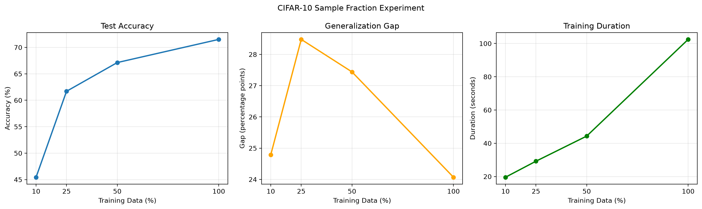
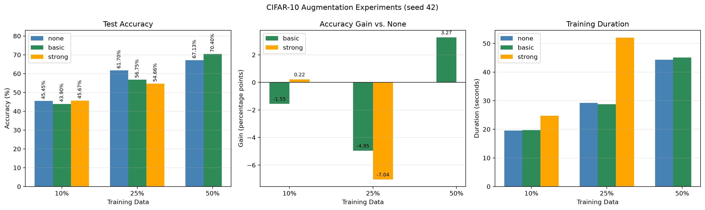

# CIFAR-10 有限训练数据与数据增强阶段报告

## 1. 实验目标

本阶段研究两个问题：训练数据量减少会怎样影响 SimpleCNN 的分类性能与泛化表现；在训练数据有限时，数据增强能否提高测试准确率。实验先建立 10%、25%、50% 和 100% 训练数据的无增强基线，再比较基础增强与较强增强，并使用新随机种子复验关键结论。

## 2. 实验设置

- 数据集：CIFAR-10，训练集 50,000 张，测试集 10,000 张。
- 子集构造：对 10 个类别分别随机抽取相同比例，保证类别分布均衡。
- 模型：SimpleCNN。
- 训练配置：10 epochs、batch size 64、SGD、学习率 0.1、CrossEntropyLoss。
- 主实验随机种子：42；关键配置复验种子：123。
- 测试集始终完整且不使用随机增强。
- 基础增强：`RandomCrop(32, padding=4) + RandomHorizontalFlip`。
- 较强增强：在基础增强上增加 `ColorJitter`。

主实验只改变训练数据比例或增强方式。训练结束后按最高测试准确率保存模型，并记录最佳轮次对应的训练准确率、测试损失、测试准确率、泛化差距和训练耗时。

## 3. 有限训练数据实验

| 训练比例 | 样本数 | 最佳测试准确率 | 泛化差距 | 训练耗时 |
| ---: | ---: | ---: | ---: | ---: |
| 10% | 5,000 | 45.45% | 24.79 个百分点 | 19.58 s |
| 25% | 12,500 | 61.70% | 28.48 个百分点 | 29.20 s |
| 50% | 25,000 | 67.13% | 27.44 个百分点 | 44.31 s |
| 100% | 50,000 | 71.51% | 24.07 个百分点 | 102.46 s |

训练数据比例增加时，测试准确率持续提高。相邻比例的提升依次为 16.25、5.43 和 4.38 个百分点，说明更多数据能够改善模型表现，但边际收益逐渐减小。训练耗时随数据量总体增加。

泛化差距没有随数据比例单调变化。10% 数据的差距较小，是因为相同 10 个 epoch 下参数更新次数更少，模型对训练集本身也没有充分拟合，不能解释为小数据具有更好的泛化能力。

## 4. 数据增强主实验

以下结果均使用随机种子 42。括号内表示相对相同数据比例无增强基线的测试准确率变化。

| 训练比例 | 无增强 | 基础增强 | 较强增强 |
| ---: | ---: | ---: | ---: |
| 10% | 45.45% | 43.90%（-1.55） | 45.67%（+0.22） |
| 25% | 61.70% | 56.75%（-4.95） | 54.66%（-7.04） |
| 50% | 67.13% | **70.40%（+3.27）** | 未运行 |

增强效果并不随强度或数据比例单调变化。10% 数据下，较强增强仅提升 0.22 个百分点，差异很小；25% 数据下，两种增强均降低准确率，其中较强增强下降 7.04 个百分点，可视为当前设置下的过强配置；50% 数据下，基础增强提升 3.27 个百分点，是主实验中最明显的正向结果。

一种可能解释是：随机裁剪和翻转扩大了训练样本的有效变化，使模型减少对固定位置和方向的依赖；但增强同时提高了训练难度，在固定 10 个 epoch 下可能尚未充分收敛。`ColorJitter` 进一步改变颜色信息，对当前模型和训练预算而言可能过强。因此，不能将结果概括为“增强越强越好”。

## 5. 随机种子配对复验

为检验 50% 数据下基础增强的提升是否只是偶然结果，使用种子 123 分别运行无增强和基础增强。相同种子下，训练子集、模型初始化和数据顺序尽量保持一致，只改变增强方式。

| 随机种子 | 无增强 | 基础增强 | 增强收益 |
| ---: | ---: | ---: | ---: |
| 42 | 67.13% | 70.40% | +3.27 个百分点 |
| 123 | 66.52% | 69.02% | +2.50 个百分点 |
| 平均 | 66.83% | 69.71% | **+2.88 个百分点** |

两个种子下基础增强的收益方向一致，初步支持“50% 训练数据下基础增强能够改善测试准确率”的结论。不过，目前只有两个随机种子，尚不足以形成严格的统计结论；更稳妥的表述是该效果具有初步稳定性。

## 6. 对泛化差距的解释

本项目将泛化差距定义为最高测试准确率所在轮次的训练准确率减测试准确率。无增强实验中，较大的正差距通常表示模型更擅长训练样本，可能存在过拟合。

增强实验中的训练准确率是在随机裁剪、翻转或颜色变化后的较难图片上计算，而测试准确率来自固定的干净测试集，因此两者难度不同。增强后的泛化差距可能接近零甚至为负，不能仅凭差距缩小就认定模型泛化一定改善，应优先比较相同种子下的测试准确率。

## 7. 局限性与下一步

- 每组主实验仅运行一次，关键配置也只有两个随机种子。
- 所有配置固定训练 10 个 epoch，但不同数据比例对应的优化器更新次数不同。
- 数据增强提高了训练难度，却没有相应增加训练轮数或调整学习率。
- 当前每轮使用测试集选择最佳模型；正式实验应划分验证集选择模型，最终只在测试集评估一次。
- 当前结论仅适用于 SimpleCNN 和现有训练配置，不能直接推广到其他模型。

下一阶段将研究 Dropout、权重衰减及其组合，并比较基线、最佳数据增强、最佳正则化以及增强与正则化组合的效果。后续报告将继续使用统一 CSV 记录配置、随机种子和指标，保证实验结果可追踪和复现。
