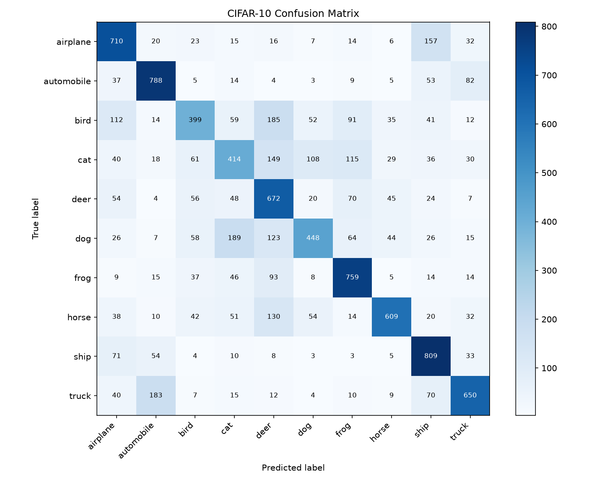

# CIFAR-10 25% 数据正式实验总结

## 实验设计

- 固定条件：`SimpleCNN`、10 个 epoch、batch size 64、SGD、学习率 0.1、`weight_decay=0`、随机种子 123。
- 数据划分：从 CIFAR-10 官方训练集分层划出 5,000 张验证图片；再从剩余 45,000 张中分层抽取 25%，得到 11,250 张训练图片。官方测试集 10,000 张在选定配置前保持封存。
- 选择规则：以最佳验证准确率为主要指标；候选配置确定后，仅对胜出 checkpoint 执行一次最终测试。

## 候选配置结果

| 数据增强 | Dropout | 最佳轮次 | 训练准确率 | 验证准确率 | 验证损失 | 验证差距 |
| --- | ---: | ---: | ---: | ---: | ---: | ---: |
| none | 0.0 | 8 | 78.95% | 60.78% | 1.2344 | 18.17% |
| basic | 0.0 | 10 | 58.99% | 59.70% | 1.1734 | -0.71% |
| none | 0.3 | 8 | 71.43% | **61.66%** | **1.1277** | 9.77% |
| basic | 0.3 | 8 | 51.75% | 57.72% | 1.1681 | -5.97% |

`none + Dropout=0.3` 的验证准确率最高，比无正则化基线提高 0.88 个百分点，同时将验证差距缩小 8.40 个百分点。存在数据增强时，训练指标来自随机增强图片，不能仅凭验证差距与无增强配置直接比较。

## 最终测试

- 胜出配置：`augmentation=none`、`Dropout=0.3`、`weight_decay=0`。
- 最佳验证准确率：61.66%。
- 测试损失：1.1086。
- 测试准确率：62.58%（6,258 / 10,000）。
- 验证与测试准确率相差 0.92 个百分点。

模型对 `ship`、`automobile` 和 `frog` 识别较好，对 `bird`、`cat` 和 `dog` 等细粒度动物类别较弱。当前结果只代表固定训练预算和单个随机种子下的受控实验，不宣称该配置是所有数据规模或训练设置下的全局最优解。
